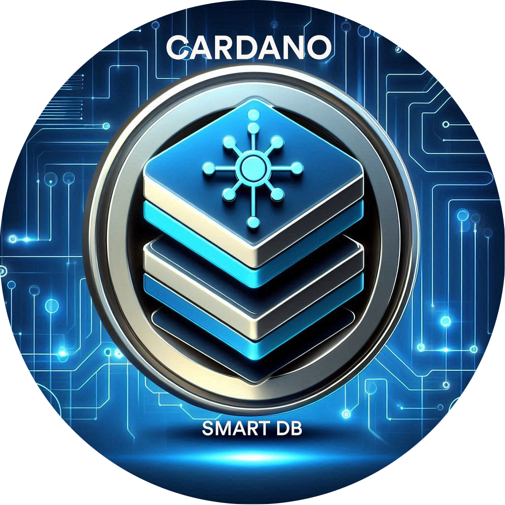

<!-- Improved compatibility of back to top link: See: https://github.com/othneildrew/Best-README-Template/pull/73 -->

<!--
*** Thanks for checking out the Best-README-Template. If you have a suggestion
*** that would make this better, please fork the repo and create a pull request
*** or simply open an issue with the tag "enhancement".
*** Don't forget to give the project a star!
*** Thanks again! Now go create something AMAZING! :D
-->

<!-- PROJECT SHIELDS -->
<!--
*** I'm using markdown "reference style" links for readability.
*** Reference links are enclosed in brackets [ ] instead of parentheses ( ).
*** See the bottom of this document for the declaration of the reference variables
*** for contributors-url, forks-url, etc. This is an optional, concise syntax you may use.
*** https://www.markdownguide.org/basic-syntax/#reference-style-links
-->
[![Contributors][contributors-shield]][contributors-url]
[![Forks][forks-shield]][forks-url]
[![Stargazers][stars-shield]][stars-url]
[![Issues][issues-shield]][issues-url]
[![MIT License][license-shield]][license-url]
[![LinkedIn][linkedin-shield]][linkedin-url]
<!-- PROJECT LOGO -->
 

  

<h3 align="center">Cardano Smart DB</h3>

  

          Memory is where fleeting moments turn to whispers, and scattered data finds its form.
     
    <a href="https://protofire-docs.gitbook.io/smartdb"><strong>Explore the docs »</strong></a>
     
     
    <a href="https://github.com/protofire/Cardano-SmartDB">View Demo</a>
    ·
    <a href="https://github.com/protofire/Cardano-SmartDB/issues">Report Bug</a>
    ·
    <a href="https://github.com/protofire/Cardano-SmartDB/issues">Request Feature</a>
  

## Table of Contents
- [Table of Contents](#table-of-contents)
- [Introduction](#introduction)
- [Features](#features)
- [The Smart DB Ecosystem](#the-smart-db-ecosystem)
  - [Core Library](#core-library)
  - [Development Tools](#development-tools)
  - [Learning \& Implementation Resources](#learning--implementation-resources)
  - [Production Reference Implementation](#production-reference-implementation)
- [Documentation](#documentation)
- [Getting Started](#getting-started)
- [Transaction Flow and Smart Selection](#transaction-flow-and-smart-selection)
- [Installation](#installation)
- [Usage](#usage)
- [Conclusion](#conclusion)
- [Cardano Catalyst Reports](#cardano-catalyst-reports)
- [Contribution](#contribution)
- [License](#license)
- [Acknowledgements](#acknowledgements)

## Introduction

The Smart DB Library is a Node.js package designed to simplify the interaction between JavaScript entities, a database, and the Cardano blockchain. It enables developers to work with entities backed by a database and synced with the blockchain, providing a transparent and seamless experience.

## Features
- **Hooks and Stores**: Provides useHooks and EasyPeasy stores to deal with wallet connection.
- **Seamless Blockchain Integration**: Simplify interactions with the Cardano blockchain using JavaScript entities.
- **Automatic Synchronization**: Automatically synchronizes the application after transactions are confirmed to reflect the latest blockchain state in the internal database. Users can also trigger synchronization manually if needed.
- **Smart UTXO Management**: Implements a sophisticated system for managing UTXOs, including distinction between reading and consuming UTXOs.
- **Smart Selection Algorithm**: Optimizes UTXO selection for transactions, maximizing throughput and minimizing conflicts in high-concurrency scenarios.
- **Concurrent Transaction Handling**: Robust system for managing multiple simultaneous transactions with minimal conflicts.
- **Authorization**: All API endpoints are secured with authorization logic using Next.js sessions and JWT tokens.
- **API Handling**: The library handles all API routes, reducing the complexity in the projects that use our library.
- **Node.js Dependency**: This is a Node.js library to add as a dependency in dApps projects.
- **Database Flexibility**: Now supports both non-relational databases (using MongoDB via Mongoose) and relational databases (using PostgreSQL via TypeORM), giving developers the flexibility to choose the most appropriate database solution for their project.
- **Query Optimization**:
  - Selective field retrieval for optimized data transfer
  - Sorting and pagination capabilities
    - Support for sorting by any field
    - Skip/limit pagination
- **Database Optimization**:  
  - Support for database indexes on entities
  - Covered queries optimization for minimizing I/O operations
  - Performance monitoring and comparison tools
  - Comparative testing between optimized and non-optimized entities
- **Token Metadata Management**:
  - Automatic retrieval and storage of token metadata from BlockFrost API
  - Local database storage to eliminate repeated external calls
  - Efficient metadata lookup for frequently accessed tokens
- **Developer Tools**: Includes scaffolding tools for entity generation, example projects, and project templates  
- **Example Project**: Includes a comprehensive example project in the `example` folder demonstrating the use of the library.

## The Smart DB Ecosystem

The Smart DB library is supported by a comprehensive ecosystem of tools, templates, and examples designed to help developers build dApps on Cardano:

### Core Library
- **[Cardano Smart DB](https://github.com/protofire/Cardano-SmartDB)** (This Repository)
  - The core library providing the foundational functionality for building dApps on Cardano
  - Handles blockchain synchronization, UTXO management, database integration, and API generation
  - Implements Smart Selection algorithm for optimal transaction handling
  - Supports both MongoDB and PostgreSQL databases
  - Provides comprehensive testing tools for concurrency and performance

### Development Tools
- **[Cardano SmartDB Scaffold](https://github.com/protofire/Cardano-SmartDB-Scaffold)**
  - Automated tools for generating GraphQL schemas and code
  - Streamlines entity creation and boilerplate code generation
  - Generates consistent project structure following best practices
  - Reduces development time through intelligent code generation
  - Supports both MongoDB and PostgreSQL schema generation

### Learning & Implementation Resources
- **[SmartDB Example Project](https://github.com/protofire/Cardano-SmartDB/tree/main/example)**
  - Basic example project demonstrating core Smart DB functionality
  - Clear examples of entity creation and blockchain synchronization
  - Includes comprehensive test suites for API endpoints
  - Demonstrates concurrency handling with Smart Selection
  - Perfect starting point for learning Smart DB concepts
  - Includes Swagger documentation for API testing

- **[SmartDB Project Template](https://github.com/protofire/Cardano-SmartDB-Template)**
  - Production-ready template for starting new Smart DB projects
  - Includes essential configurations and project structure
  - Step-by-step guide for building a basic project
  - Examples of common implementation patterns
  - Designed for quick project bootstrapping

### Production Reference Implementation
- **[Cardano Simple Marketplace](https://github.com/protofire/Cardano-Simple-Marketplace)**
  - Complete end-to-end implementation of a production dApp
  - Full-featured NFT marketplace with buy/sell functionality
  - Demonstrates advanced Smart DB features in a real-world context
  - Includes on-chain and off-chain integration
  - Showcases best practices for production deployment
  - Serves as a comprehensive reference implementation

## Documentation

For comprehensive, structured documentation covering the entire Smart DB ecosystem, including detailed guides, tutorials, and API references, please visit our [Gitbook Documentation](https://protofire-docs.gitbook.io/smartdb/).

The Gitbook documentation includes:
- Complete Smart DB library reference
- Step-by-step guides for the Scaffold tools
- Project template tutorials
- Marketplace implementation examples
- Best practices and common patterns
- Testing and deployment guides

While each repository contains its own README with specific information, the Gitbook serves as a unified resource where all documentation is organized and interconnected, making it easier to understand how all components work together.

## Getting Started

To begin developing with Smart DB, we recommend the following path:

1. Review this repository's documentation to understand core concepts
2. Explore the Example Project to learn basic implementations
3. Use the Scaffold tools to generate your initial project structure
4. Reference the Project Template for implementation patterns
5. Study the Simple Marketplace for advanced usage and production patterns

## Transaction Flow and Smart Selection

The Smart DB Library implements a sophisticated transaction flow that includes:

- Distinction between reading (reference) and consuming UTXOs.
- Smart selection of UTXOs to optimize transaction success and system throughput.
- Concurrent transaction handling with minimal conflicts.
- Automatic UTXO locking and release mechanisms.
- Detailed transaction state management.

For a comprehensive explanation of the transaction flow, smart UTXO management, and the smart selection algorithm, please refer to our [Transaction Flow Documentation](docs/transactions.md).

For detailed concurrency tests that rigorously assess the performance and reliability of the Smart UTXO and Smart Selection systems across various scenarios, please refer to our 
[Concurrency Tests](example/docs/tests.md) or within the [GitBook](https://protofire-docs.gitbook.io/smartdb/smartdb-example/tests).

## Installation

Refer to [Installation](docs/installation.md) for detailed installation instructions.

## Usage

For information on how to use the Smart DB Library, including setting up entities, configuring the backend, and handling API routes, please refer to our [Usage Guide](docs/usage.md).

## Conclusion

The Smart DB library bridges the gap between traditional web application development and blockchain-based data management. By abstracting complex blockchain operations into familiar JavaScript entity interactions, it offers a developer-friendly pathway to blockchain integration. The sophisticated transaction handling and UTXO management systems enable the development of high-performance, concurrent dApps on the Cardano blockchain.

## Cardano Catalyst Reports
Here are the links to the Catalyst Milestone reports for the Cardano Smart DB project. Each report provides an update on the project's progress, achievements, and next steps for each milestone.

- [**Milestone 1 Report**](https://docs.google.com/document/d/1JfyuJceSvcd6JPbB1dk6CswelUD-9YNBhHsmnCC_gtg/edit?usp=drive_link)
- [**Milestone 2 Report**](https://docs.google.com/document/d/1x0QuRGvYsMm_tkiH-LQCRiWGd4pJwuoxDmpJytsMF0I/edit?usp=drive_link)
- [**Milestone 3 Report**](https://docs.google.com/document/d/1F36mhjyY7_zNAA7A3tcC1ILNPtY-Y5O7M9_eV5v6ZSk/edit?usp=drive_link)
- [**Milestone 4 Report**](https://docs.google.com/document/d/1HZ3T2exp1-89egSQz68BjLLoT-_5peX-BBikxyn-lxs/edit?usp=drive_link)
- [**Milestone 5 Report**](https://docs.google.com/document/d/1AC3yMv7RMhNhWUYSKhEsckpPm3LpHck-nGWYuivJctE/edit?usp=drive_link)
- [**Milestone 6 Report**](https://docs.google.com/document/d/1_-8YYQC6W19ujIkq1Ndrv7I4Xqxk-GrOiuC3KCD7glY/edit?usp=drive_link)
- [**Milestone 7 Report**](https://docs.google.com/document/d/1ChW2hPzBQj4k5J75zNerUtYpjcB-k_apki_nISmcqjs/edit?usp=drive_link)

For more details on our progress and achievements, please refer to each report.

## Contribution

Contributions to the Cardano Smart DB are welcome. Whether you're looking to fix bugs, add new features, or improve documentation, your help is appreciated.

## License

This project is licensed under the GNU General Public License v3.0 - see the [LICENSE](LICENSE) file for details.

## Acknowledgements

We express our deepest gratitude to the Cardano community for their unwavering support and valuable contributions to this project. This work is part of a funded project through Cardano Catalyst, a community-driven innovation platform. For more details on the proposal and its progress, please visit our proposal page on [IdeaScale](https://cardano.ideascale.com/c/idea/110478).

[contributors-shield]: https://img.shields.io/github/contributors/protofire/Cardano-SmartDB.svg?style=for-the-badge
[contributors-url]: https://github.com/protofire/Cardano-SmartDB/graphs/contributors
[forks-shield]: https://img.shields.io/github/forks/protofire/Cardano-SmartDB.svg?style=for-the-badge
[forks-url]: https://github.com/protofire/Cardano-SmartDB/network/members
[stars-shield]: https://img.shields.io/github/stars/protofire/Cardano-SmartDB.svg?style=for-the-badge
[stars-url]: https://github.com/protofire/Cardano-SmartDB/stargazers
[issues-shield]: https://img.shields.io/github/issues/protofire/Cardano-SmartDB.svg?style=for-the-badge
[issues-url]: https://github.com/protofire/Cardano-SmartDB/issues
[license-shield]: https://img.shields.io/github/license/protofire/Cardano-SmartDB.svg?style=for-the-badge
[license-url]: https://github.com/protofire/Cardano-SmartDB/blob/master/LICENSE
[linkedin-shield]: https://img.shields.io/badge/-LinkedIn-black.svg?style=for-the-badge&logo=linkedin&colorB=555
[linkedin-url]: https://www.linkedin.com/company/protofire-io/posts/?feedView=all
[product-screenshot]: images/screenshot.png
[usage-example]: images/example.png