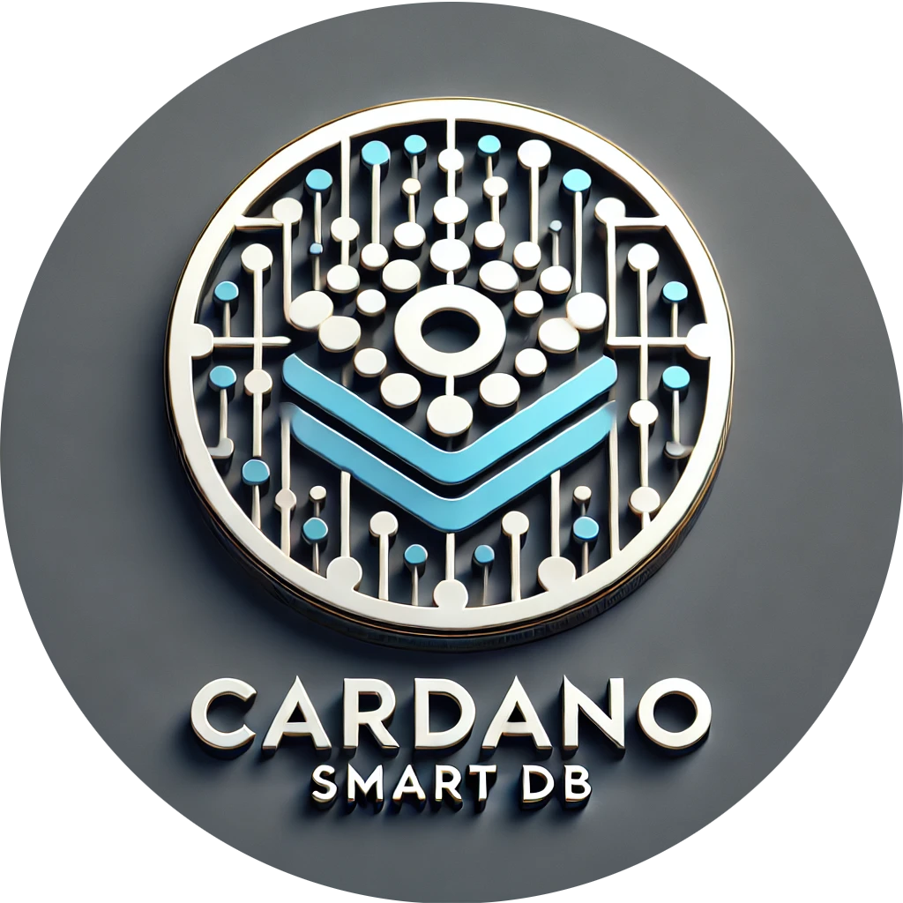

<!-- Improved compatibility of back to top link: See: https://github.com/othneildrew/Best-README-Template/pull/73 -->

<!--
*** Thanks for checking out the Best-README-Template. If you have a suggestion
*** that would make this better, please fork the repo and create a pull request
*** or simply open an issue with the tag "enhancement".
*** Don't forget to give the project a star!
*** Thanks again! Now go create something AMAZING! :D
-->

<!-- PROJECT SHIELDS -->
<!--
*** I'm using markdown "reference style" links for readability.
*** Reference links are enclosed in brackets [ ] instead of parentheses ( ).
*** See the bottom of this document for the declaration of the reference variables
*** for contributors-url, forks-url, etc. This is an optional, concise syntax you may use.
*** https://www.markdownguide.org/basic-syntax/#reference-style-links
-->
[![Contributors][contributors-shield]][contributors-url]
[![Forks][forks-shield]][forks-url]
[![Stargazers][stars-shield]][stars-url]
[![Issues][issues-shield]][issues-url]
[![MIT License][license-shield]][license-url]
[![LinkedIn][linkedin-shield]][linkedin-url]
<!-- PROJECT LOGO -->
 

  

<h3 align="center">Cardano Smart DB</h3>

  

          Memory is where fleeting moments turn to whispers, and scattered data finds its form.
     
    <a href="https://protofire-docs.gitbook.io/smartdb"><strong>Explore the docs »</strong></a>
     
     
    <a href="https://github.com/protofire/Cardano-SmartDB">View Demo</a>
    ·
    <a href="https://github.com/protofire/Cardano-SmartDB/issues">Report Bug</a>
    ·
    <a href="https://github.com/protofire/Cardano-SmartDB/issues">Request Feature</a>
  

## Table of Contents
- [Smart DB Library](#smart-db-library)
  - [Table of Contents](#table-of-contents)
  - [Introduction](#introduction)
  - [Features](#features)
  - [Transaction Flow and Smart Selection](#transaction-flow-and-smart-selection)
  - [Documentation](#documentation)
  - [Installation](#installation)
  - [Usage](#usage)
  - [Conclusion](#conclusion)
  - [Contribution](#contribution)
  - [License](#license)
  - [Acknowledgements](#acknowledgements)

## Introduction

The Smart DB Library is a Node.js package designed to simplify the interaction between JavaScript entities, a database, and the Cardano blockchain. It enables developers to work with entities backed by a database and synced with the blockchain, providing a transparent and seamless experience.

## Features
- **Hooks and Stores**: Provides useHooks and EasyPeasy stores to deal with wallet connection.
- **Seamless Blockchain Integration**: Simplify interactions with the Cardano blockchain using JavaScript entities.
- **Automatic Synchronization**: Automatically synchronizes the application after transactions are confirmed to reflect the latest blockchain state in the internal database. Users can also trigger synchronization manually if needed.
- **Smart UTXO Management**: Implements a sophisticated system for managing UTXOs, including distinction between reading and consuming UTXOs.
- **Smart Selection Algorithm**: Optimizes UTXO selection for transactions, maximizing throughput and minimizing conflicts in high-concurrency scenarios.
- **Concurrent Transaction Handling**: Robust system for managing multiple simultaneous transactions with minimal conflicts.
- **Authorization**: All API endpoints are secured with authorization logic using Next.js sessions and JWT tokens.
- **API Handling**: The library handles all API routes, reducing the complexity in the projects that use our library.
- **Example Project**: Includes a comprehensive example project in the `example` folder demonstrating the use of the library.
- **Node.js Dependency**: This is a Node.js library to add as a dependency in dApps projects.
- **Database Flexibility**: Now supports both non-relational databases (using MongoDB via Mongoose) and relational databases (using PostgreSQL via TypeORM), giving developers the flexibility to choose the most appropriate database solution for their project.

## Transaction Flow and Smart Selection

The Smart DB Library implements a sophisticated transaction flow that includes:

- Distinction between reading (reference) and consuming UTXOs.
- Smart selection of UTXOs to optimize transaction success and system throughput.
- Concurrent transaction handling with minimal conflicts.
- Automatic UTXO locking and release mechanisms.
- Detailed transaction state management.

For a comprehensive explanation of the transaction flow, smart UTXO management, and the smart selection algorithm, please refer to our [Transaction Flow Documentation](docs/transactions.md).

For detailed concurrency tests that rigorously assess the performance and reliability of the Smart UTXO and Smart Selection systems across various scenarios, please refer to our 
[Concurrency Tests](example/docs/tests.md) or within the [GitBook](https://protofire-docs.gitbook.io/smartdb-example/tests).

## Documentation

For detailed documentation, please visit our [Gitbook](https://protofire-docs.gitbook.io/smartdb/).

## Installation

Refer to [Installation](docs/installation.md) for detailed installation instructions.

## Usage

For information on how to use the Smart DB Library, including setting up entities, configuring the backend, and handling API routes, please refer to our [Usage Guide](docs/usage.md).

## Conclusion

The Smart DB library bridges the gap between traditional web application development and blockchain-based data management. By abstracting complex blockchain operations into familiar JavaScript entity interactions, it offers a developer-friendly pathway to blockchain integration. The sophisticated transaction handling and UTXO management systems enable the development of high-performance, concurrent dApps on the Cardano blockchain.

## Contribution

Contributions to the Cardano Smart DB are welcome. Whether you're looking to fix bugs, add new features, or improve documentation, your help is appreciated.

## License

This project is licensed under the GNU General Public License v3.0 - see the [LICENSE](LICENSE) file for details.

## Acknowledgements

We express our deepest gratitude to the Cardano community for their unwavering support and valuable contributions to this project. This work is part of a funded project through Cardano Catalyst, a community-driven innovation platform. For more details on the proposal and its progress, please visit our proposal page on [IdeaScale](https://cardano.ideascale.com/c/idea/110478).

[contributors-shield]: https://img.shields.io/github/contributors/protofire/Cardano-SmartDB.svg?style=for-the-badge
[contributors-url]: https://github.com/protofire/Cardano-SmartDB/graphs/contributors
[forks-shield]: https://img.shields.io/github/forks/protofire/Cardano-SmartDB.svg?style=for-the-badge
[forks-url]: https://github.com/protofire/Cardano-SmartDB/network/members
[stars-shield]: https://img.shields.io/github/stars/protofire/Cardano-SmartDB.svg?style=for-the-badge
[stars-url]: https://github.com/protofire/Cardano-SmartDB/stargazers
[issues-shield]: https://img.shields.io/github/issues/protofire/Cardano-SmartDB.svg?style=for-the-badge
[issues-url]: https://github.com/protofire/Cardano-SmartDB/issues
[license-shield]: https://img.shields.io/github/license/protofire/Cardano-SmartDB.svg?style=for-the-badge
[license-url]: https://github.com/protofire/Cardano-SmartDB/blob/master/LICENSE
[linkedin-shield]: https://img.shields.io/badge/-LinkedIn-black.svg?style=for-the-badge&logo=linkedin&colorB=555
[linkedin-url]: https://www.linkedin.com/company/protofire-io/posts/?feedView=all
[product-screenshot]: images/screenshot.png
[usage-example]: images/example.png